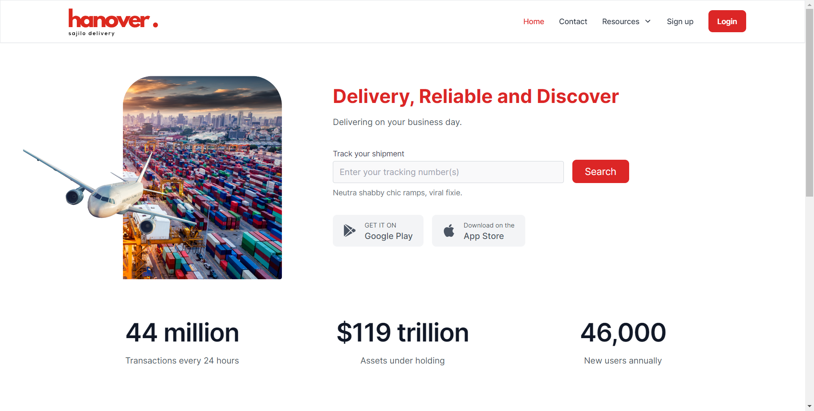

<!--
Hey, thanks for using the awesome-readme-template template.  
If you have any enhancements, then fork this project and create a pull request 
or just open an issue with the label "enhancement".

Don't forget to give this project a star for additional support ;)
Maybe you can mention me or this repo in the acknowledgements too
-->
<div align="center">

  
  <h1>Hanover</h1>
  
  
  <!-- <p>
    An awesome README template for your projects! 
  </p> -->
  
  
<!-- Badges -->
<p>
  <a href="https://github.com/Louis3797/awesome-readme-template/graphs/contributors">
    
  </a>
  <a href="https://github.com/Louis3797/awesome-readme-template/graphs/contributors">
    
  </a>
  <a href="">
    
  </a>
  <a href="https://github.com/Louis3797/awesome-readme-template/network/members">
    
  </a>
  <a href="https://github.com/Louis3797/awesome-readme-template/stargazers">
    
  </a>
  <a href="https://github.com/Louis3797/awesome-readme-template/issues/">
    
  </a>
  <a href="https://github.com/Louis3797/awesome-readme-template/blob/master/LICENSE">
    
  </a>
</p>
   
<h4>
    <a href="https://github.com/Louis3797/awesome-readme-template/">View Demo</a>
  <span> · </span>
    <a href="https://github.com/Louis3797/awesome-readme-template">Documentation</a>
  <span> · </span>
    <a href="https://github.com/Louis3797/awesome-readme-template/issues/">Report Bug</a>
  <span> · </span>
    <a href="https://github.com/Louis3797/awesome-readme-template/issues/">Request Feature</a>
  </h4>
</div>

<br />

<!-- Table of Contents -->
# Table of Contents

- [About the Project](#star2-about-the-project)
  * [Screenshots](#camera-screenshots)
  * [Tech Stack](#space_invader-tech-stack)
  * [Features](#dart-features)
  * [Color Reference](#art-color-reference)
  * [Environment Variables](#key-environment-variables)
- [Getting Started](#toolbox-getting-started)
  * [Prerequisites](#bangbang-prerequisites)
  * [Installation](#gear-installation)
  * [Running Tests](#test_tube-running-tests)
  * [Run Locally](#running-run-locally)
  * [Deployment](#triangular_flag_on_post-deployment)
- [Usage](#eyes-usage)
- [Roadmap](#compass-roadmap)
- [Contributing](#wave-contributing)
  * [Code of Conduct](#scroll-code-of-conduct)
- [FAQ](#grey_question-faq)
- [License](#warning-license)
- [Contact](#handshake-contact)
- [Acknowledgements](#gem-acknowledgements)

  

<!-- About the Project -->
## :star2: About the Project
<p>Hanover is a comprehensive order tracking solution designed to streamline and enhance the entire order management process. From placing an order to its final delivery, Hanover ensures transparency, accessibility, and real-time updates for all stakeholders involved.</p>


<!-- Screenshots -->
### :camera: Screenshots

<div align="center"> 
  
</div>


<!-- TechStack -->
### :space_invader: Tech Stack

<div display="flex">
<a href="https://www.mongodb.com/">
<svg width="50" height="50" viewBox="0 0 256 256" fill="none" xmlns="http://www.w3.org/2000/svg">
<rect width="256" height="256" rx="60" fill="#F0DB4F"/>
<path d="M67.3117 213.932L86.9027 202.076C90.6821 208.777 94.1202 214.447 102.367 214.447C110.272 214.447 115.256 211.355 115.256 199.327V117.529H139.314V199.667C139.314 224.584 124.708 235.926 103.398 235.926C84.1533 235.926 72.9819 225.959 67.3113 213.93" fill="#323330"/>
<path d="M152.381 211.354L171.969 200.013C177.126 208.434 183.828 214.62 195.684 214.62C205.653 214.62 212.009 209.636 212.009 202.762C212.009 194.514 205.479 191.592 194.481 186.782L188.468 184.203C171.111 176.815 159.597 167.535 159.597 147.945C159.597 129.901 173.345 116.153 194.826 116.153C210.12 116.153 221.118 121.481 229.022 135.4L210.291 147.429C206.166 140.04 201.7 137.119 194.826 137.119C187.78 137.119 183.312 141.587 183.312 147.429C183.312 154.646 187.78 157.568 198.09 162.037L204.104 164.614C224.553 173.379 236.067 182.313 236.067 202.418C236.067 224.072 219.055 235.928 196.2 235.928C173.861 235.928 159.426 225.274 152.381 211.354" fill="#323330"/>
</svg>
</a>
<a href= "https://reactjs.org/">
<svg xmlns="http://www.w3.org/2000/svg" width="50" height="50" fill="none" viewBox="0 0 256 256"><rect width="256" height="256" fill="#242938" rx="60"/><path fill="#00D8FF" d="M128.001 146.951C138.305 146.951 146.657 138.598 146.657 128.295C146.657 117.992 138.305 109.639 128.001 109.639C117.698 109.639 109.345 117.992 109.345 128.295C109.345 138.598 117.698 146.951 128.001 146.951Z"/><path fill-rule="evenodd" stroke="#00D8FF" stroke-width="8.911" d="M128.002 90.3633C153.05 90.3633 176.319 93.9575 193.864 99.9976C215.003 107.275 228 118.306 228 128.295C228 138.704 214.226 150.423 191.525 157.944C174.363 163.63 151.779 166.598 128.002 166.598C103.624 166.598 80.5389 163.812 63.1834 157.881C41.2255 150.376 28 138.506 28 128.295C28 118.387 40.4096 107.441 61.2515 100.175C78.8617 94.0353 102.705 90.3633 127.998 90.3633H128.002Z" clip-rule="evenodd"/><path fill-rule="evenodd" stroke="#00D8FF" stroke-width="8.911" d="M94.9811 109.438C107.495 87.7402 122.232 69.3783 136.23 57.1971C153.094 42.5206 169.144 36.7728 177.796 41.7623C186.813 46.9623 190.084 64.7496 185.259 88.1712C181.614 105.879 172.9 126.925 161.021 147.523C148.842 168.641 134.897 187.247 121.09 199.315C103.619 214.587 86.7284 220.114 77.8833 215.013C69.3003 210.067 66.0181 193.846 70.1356 172.161C73.6145 153.838 82.3451 131.349 94.977 109.438L94.9811 109.438Z" clip-rule="evenodd"/><path fill-rule="evenodd" stroke="#00D8FF" stroke-width="8.911" d="M95.0123 147.578C82.4633 125.904 73.9194 103.962 70.3531 85.7517C66.0602 63.8109 69.0954 47.0355 77.7401 42.0315C86.7485 36.8163 103.792 42.866 121.674 58.7437C135.194 70.7479 149.077 88.8052 160.99 109.383C173.204 130.481 182.358 151.856 185.919 169.844C190.425 192.608 186.778 210.001 177.941 215.116C169.367 220.08 153.676 214.825 136.945 200.427C122.809 188.263 107.685 169.468 95.0123 147.578Z" clip-rule="evenodd"/></svg>
</a>
<a href="https://www.mongodb.com/">
<svg xmlns="http://www.w3.org/2000/svg" width="50" height="50" fill="none" viewBox="0 0 256 256"><rect width="256" height="256" fill="#F4F2ED" rx="60"/><path fill="#000" d="M121.451 28.0537C121.021 28.0928 119.652 28.2297 118.42 28.3274C90.0137 30.8885 63.4057 46.216 46.5533 69.7742C37.1691 82.8729 31.1672 97.7312 28.8993 113.469C28.0978 118.963 28 120.586 28 128.034C28 135.483 28.0978 137.106 28.8993 142.599C34.3343 180.155 61.0596 211.71 97.306 223.401C103.797 225.493 110.639 226.92 118.42 227.78C121.451 228.112 134.549 228.112 137.58 227.78C151.011 226.294 162.389 222.971 173.611 217.242C175.331 216.363 175.664 216.128 175.429 215.933C175.273 215.815 167.941 205.981 159.144 194.095L143.152 172.492L123.112 142.834C112.086 126.529 103.015 113.195 102.936 113.195C102.858 113.176 102.78 126.353 102.741 142.443C102.682 170.615 102.663 171.749 102.311 172.413C101.803 173.371 101.412 173.762 100.59 174.193C99.9648 174.505 99.4174 174.564 96.4653 174.564H93.0831L92.1838 173.997C91.5973 173.626 91.1672 173.137 90.8739 172.57L90.4633 171.69L90.5024 132.492L90.5611 93.2737L91.1672 92.5112C91.48 92.1007 92.1447 91.5728 92.6139 91.3186C93.4154 90.9276 93.7283 90.8885 97.1105 90.8885C101.099 90.8885 101.763 91.0449 102.8 92.1789C103.093 92.4917 113.943 108.836 126.925 128.523C139.906 148.21 157.658 175.092 166.377 188.288L182.213 212.277L183.015 211.749C190.111 207.135 197.619 200.566 203.562 193.723C216.211 179.197 224.364 161.485 227.101 142.599C227.902 137.106 228 135.483 228 128.034C228 120.586 227.902 118.963 227.101 113.469C221.666 75.913 194.94 44.3587 158.694 32.6676C152.301 30.5953 145.498 29.1681 137.873 28.3079C135.996 28.1124 123.073 27.8973 121.451 28.0537ZM162.389 88.5425C163.327 89.0117 164.09 89.911 164.364 90.8494C164.52 91.3577 164.559 102.228 164.52 126.724L164.461 161.876L158.264 152.374L152.047 142.873V117.321C152.047 100.801 152.125 91.5141 152.242 91.0645C152.555 89.9697 153.239 89.1095 154.178 88.6011C154.979 88.1906 155.273 88.1515 158.342 88.1515C161.236 88.1515 161.744 88.1906 162.389 88.5425Z"/></svg>
</a>
<a href="https://www.mongodb.com/">
<svg xmlns="http://www.w3.org/2000/svg" width="50" height="50" fill="none" viewBox="0 0 256 256"><rect width="256" height="256" fill="#242938" rx="60"/><path fill="#fff" d="M228 182.937C225.089 184.04 221.875 184.037 218.965 182.931C216.056 181.824 213.652 179.69 212.209 176.932C203.146 163.365 193.138 150.41 183.519 137.177L179.348 131.617C167.894 146.963 156.44 161.697 145.987 176.988C144.625 179.624 142.352 181.675 139.59 182.759C136.828 183.844 133.766 183.887 130.975 182.882L173.955 125.223L133.977 73.1236C136.855 72.0845 140.003 72.0702 142.89 73.0832C145.777 74.0962 148.226 76.0744 149.824 78.6838C159.109 92.2506 169.396 105.206 179.626 118.94C189.913 105.317 200.088 92.3062 209.596 78.8506C210.965 76.2574 213.24 74.258 215.988 73.2328C218.735 72.2076 221.764 72.2281 224.497 73.2904L208.984 93.8631C202.034 103.037 195.195 112.267 187.967 121.219C187.384 121.741 186.918 122.379 186.599 123.093C186.28 123.807 186.115 124.58 186.115 125.362C186.115 126.143 186.28 126.916 186.599 127.63C186.918 128.344 187.384 128.982 187.967 129.504C201.256 147.13 214.433 164.811 228 182.937V182.937Z"/><path fill="#fff" d="M28 124.5C29.1676 118.94 29.8905 112.879 31.5029 107.208C41.122 73.0129 80.3214 58.7788 107.288 79.9632C123.079 92.3624 127.027 109.933 126.249 129.727H37.2855C35.8399 165.09 61.3611 186.441 93.9994 175.543C99.2938 173.649 104.033 170.467 107.79 166.283C111.547 162.099 114.202 157.045 115.517 151.578C117.241 146.018 120.021 145.073 125.303 146.685C124.433 153.454 122.04 159.938 118.303 165.649C114.567 171.36 109.584 176.149 103.73 179.657C94.0573 184.947 82.96 187.042 72.0247 185.644C61.0894 184.246 50.8763 179.426 42.8457 171.873C34.9011 162.94 30.0973 151.654 29.1676 139.735C29.1676 137.845 28.4448 135.954 28.0556 134.175C28.0185 130.876 28 127.651 28 124.5ZM37.3967 122.109H117.853C117.352 96.4769 101.172 78.2951 79.5986 78.1283C55.5785 77.7947 38.3976 95.5873 37.3411 121.998L37.3967 122.109Z"/></svg>
</a>
<a href="https://www.mongodb.com/">
<svg xmlns="http://www.w3.org/2000/svg" width="50" height="50" fill="none" viewBox="0 0 256 256"><rect width="256" height="256" fill="#242938" rx="60"/><path fill="#81CD39" d="M119.878 31.1164C124.797 28.3008 131.203 28.2883 136.117 31.1164C160.839 45.0855 185.569 59.0332 210.287 73.0108C214.937 75.6296 218.046 80.8038 217.999 86.1608V170.206C218.034 175.785 214.617 181.083 209.712 183.642C185.071 197.535 160.442 211.444 135.805 225.337C130.786 228.207 124.251 227.986 119.387 224.88C112 220.598 104.6 216.336 97.2121 212.058C95.7022 211.158 94.0004 210.442 92.9345 208.978C93.8766 207.708 95.5618 207.55 96.9309 206.995C100.014 206.014 102.847 204.44 105.679 202.913C106.396 202.423 107.27 202.611 107.957 203.049C114.274 206.671 120.536 210.399 126.874 213.986C128.226 214.767 129.595 213.73 130.751 213.086C154.931 199.419 179.141 185.805 203.318 172.134C204.214 171.703 204.709 170.752 204.636 169.771C204.653 142.046 204.64 114.317 204.645 86.5918C204.747 85.4785 204.103 84.455 203.096 83.999C178.541 70.1702 153.997 56.3205 129.446 42.4882C128.575 41.8893 127.426 41.8878 126.554 42.4837C102.002 56.3205 77.4638 70.1832 52.9124 84.011C51.9092 84.4675 51.236 85.4745 51.3554 86.5918C51.3596 114.317 51.3554 142.046 51.3554 169.775C51.2682 170.756 51.801 171.687 52.6906 172.109C59.2422 175.824 65.8024 179.513 72.3582 183.216C76.0516 185.203 80.5863 186.385 84.6555 184.862C88.2463 183.574 90.7633 179.909 90.6948 176.097C90.7288 148.534 90.6778 120.967 90.7203 93.4078C90.6309 92.1841 91.7912 91.1731 92.981 91.2885C96.1292 91.267 99.281 91.2461 102.429 91.297C103.743 91.267 104.647 92.5847 104.485 93.8174C104.472 121.555 104.519 149.293 104.464 177.03C104.472 184.423 101.435 192.467 94.5973 196.084C86.1737 200.447 75.7619 199.522 67.4399 195.338C60.2355 191.742 53.3603 187.498 46.2838 183.646C41.3661 181.101 37.966 175.782 38.0006 170.207V86.1608C37.949 80.6929 41.1825 75.4248 45.9764 72.8445C70.6133 58.9408 95.2461 45.0261 119.878 31.1164Z"/><path fill="#81CD39" d="M141.372 89.3351C152.117 88.6433 163.62 88.9255 173.289 94.2185C180.776 98.2754 184.926 106.789 185.058 115.106C184.849 116.227 183.676 116.846 182.605 116.769C179.488 116.765 176.369 116.812 173.252 116.748C171.929 116.799 171.161 115.58 170.995 114.411C170.099 110.431 167.928 106.49 164.183 104.57C158.433 101.692 151.767 101.837 145.497 101.897C140.92 102.139 135.998 102.536 132.12 105.227C129.143 107.266 128.239 111.382 129.301 114.697C130.303 117.077 133.05 117.845 135.299 118.553C148.248 121.94 161.97 121.602 174.672 126.059C179.931 127.876 185.075 131.409 186.875 136.915C189.23 144.295 188.198 153.115 182.947 159.039C178.689 163.914 172.488 166.568 166.303 168.009C158.075 169.844 149.536 169.891 141.18 169.076C133.323 168.18 125.146 166.116 119.081 160.763C113.894 156.259 111.361 149.241 111.612 142.469C111.672 141.325 112.811 140.527 113.907 140.621C117.046 140.596 120.186 140.587 123.325 140.626C124.58 140.536 125.509 141.62 125.574 142.802C126.152 146.593 127.577 150.573 130.884 152.82C137.264 156.937 145.271 156.655 152.577 156.77C158.63 156.502 165.425 156.421 170.364 152.42C172.97 150.138 173.742 146.32 173.038 143.036C172.275 140.263 169.374 138.971 166.883 138.126C154.1 134.083 140.224 135.55 127.565 130.977C122.425 129.161 117.455 125.727 115.481 120.447C112.726 112.974 113.988 103.73 119.789 98.0061C125.445 92.312 133.609 90.1192 141.372 89.3346V89.3351"/></svg>
</a>
<a href="https://www.mongodb.com/">
<svg xmlns="http://www.w3.org/2000/svg" width="50" height="50" fill="none" viewBox="0 0 256 256"><rect width="256" height="256" fill="#023430" rx="60"/><path fill="#10AA50" d="M171.173 107.591C160.636 61.1097 138.676 48.7357 133.074 39.9886C130.764 36.1353 128.717 32.1299 126.949 28C126.653 32.1292 126.109 34.7307 122.599 37.862C115.552 44.1454 85.6217 68.5354 83.1028 121.348C80.756 170.59 119.303 200.953 124.395 204.092C128.311 206.019 133.08 204.133 135.407 202.364C153.988 189.612 179.376 155.614 171.193 107.591"/><path fill="#B8C4C2" d="M128.545 177.871C127.575 190.059 126.88 197.141 124.416 204.106C124.416 204.106 126.033 215.709 127.169 228H131.188C132.147 219.345 133.61 210.753 135.572 202.268C130.369 199.708 128.745 188.566 128.545 177.871Z"/><path fill="#12924F" d="M135.565 202.275C130.307 199.846 128.786 188.469 128.552 177.871C129.852 160.388 130.231 142.849 129.688 125.326C129.412 116.132 129.818 40.1676 127.423 29.0461C129.062 32.8129 130.949 36.4662 133.074 39.9818C138.676 48.7358 160.643 61.1097 171.173 107.591C179.376 155.532 154.126 189.44 135.565 202.275Z"/></svg>
</a>
<a href="https://www.mongodb.com/">
<svg xmlns="http://www.w3.org/2000/svg" width="50" height="50" fill="none" viewBox="0 0 256 256"><rect width="256" height="256" fill="#242938" rx="60"/><path fill="url(#paint0_linear_2_119)" fill-rule="evenodd" d="M83 110C88.9991 86.0009 104.001 74 128 74C164 74 168.5 101 186.5 105.5C198.501 108.501 209 104.001 218 92C212.001 115.999 196.999 128 173 128C137 128 132.5 101 114.5 96.5C102.499 93.4991 92 97.9991 83 110ZM38 164C43.9991 140.001 59.0009 128 83 128C119 128 123.5 155 141.5 159.5C153.501 162.501 164 158.001 173 146C167.001 169.999 151.999 182 128 182C92 182 87.5 155 69.5 150.5C57.4991 147.499 47 151.999 38 164Z" clip-rule="evenodd"/><defs><linearGradient id="paint0_linear_2_119" x1="86.5" x2="163.5" y1="74" y2="185.5" gradientUnits="userSpaceOnUse"><stop stop-color="#32B1C1"/><stop offset="1" stop-color="#14C6B7"/></linearGradient></defs></svg>
</a>
<a href="https://www.mongodb.com/">
<svg width="50" height="50" viewBox="0 0 256 256" fill="none" xmlns="http://www.w3.org/2000/svg">
<rect width="256" height="256" rx="60" fill="#FF6C37"/>
<path d="M169.061 88.6123L118.521 139.153L104.268 124.901C153.971 75.1986 158.882 79.5101 169.061 88.6123Z" fill="#EEEEEE"/>
<path d="M118.521 140.35C118.161 140.35 117.922 140.231 117.682 139.991L103.31 125.739C102.831 125.26 102.831 124.542 103.31 124.063C153.851 73.5211 159.12 78.3118 169.78 87.8932C170.02 88.1328 170.139 88.3724 170.139 88.7317C170.139 89.0911 170.02 89.3306 169.78 89.5694L119.239 139.991C119.12 140.231 118.76 140.35 118.521 140.35ZM105.945 124.901L118.521 137.476L167.265 88.7317C158.403 80.8266 152.414 78.4316 105.945 124.901Z" fill="#FF6C37"/>
<path d="M133.012 153.645L119.239 139.872L169.78 89.3315C183.314 102.984 163.073 125.141 133.012 153.645Z" fill="#EEEEEE"/>
<path d="M133.012 154.843C132.652 154.843 132.414 154.723 132.174 154.483L118.401 140.71C118.161 140.471 118.161 140.231 118.161 139.872C118.161 139.512 118.281 139.273 118.521 139.033L169.061 88.4927C169.54 88.0135 170.259 88.0135 170.738 88.4927C173.852 91.3668 175.529 95.4387 175.409 99.6305C175.17 112.924 160.079 129.811 133.97 154.483C133.611 154.723 133.251 154.843 133.012 154.843ZM120.916 139.872C128.58 147.656 131.815 150.771 133.012 151.968C153.133 132.806 172.654 113.164 172.774 99.6305C172.894 96.5168 171.697 93.4031 169.66 91.0074L120.916 139.872Z" fill="#FF6C37"/>
<path d="M104.508 125.26L114.688 135.44C114.927 135.68 114.927 135.919 114.688 136.159C114.568 136.279 114.568 136.279 114.449 136.279L93.3693 140.83C92.292 140.95 91.3337 140.231 91.0942 139.153C90.9744 138.554 91.214 137.956 91.5733 137.596L103.789 125.38C104.029 125.14 104.388 125.02 104.508 125.26Z" fill="#EEEEEE"/>
<path d="M93.01 142.028C91.214 142.028 89.8963 140.59 89.8963 138.793C89.8963 137.956 90.2557 137.117 90.8546 136.518L103.07 124.302C103.789 123.703 104.748 123.703 105.466 124.302L115.646 134.482C116.364 135.081 116.364 136.159 115.646 136.877C115.406 137.117 115.167 137.237 114.807 137.357L93.7287 141.908C93.4891 141.908 93.2495 142.028 93.01 142.028ZM104.149 126.577L92.4118 138.314C92.1723 138.554 92.0525 138.913 92.292 139.272C92.4118 139.632 92.7704 139.752 93.1298 139.632L112.891 135.32L104.149 126.577Z" fill="#FF6C37"/>
<path d="M195.769 60.5877C188.104 53.1625 175.768 53.4021 168.342 61.1867C160.917 68.9712 161.157 81.1871 168.941 88.6131C175.289 94.7207 184.871 95.7988 192.416 91.2476L178.762 77.5943L195.769 60.5877Z" fill="#EEEEEE"/>
<path d="M182.355 95.1996C170.978 95.1996 161.756 85.9776 161.756 74.6002C161.756 63.222 170.978 54 182.355 54C187.625 54 192.775 56.0364 196.607 59.749C196.847 59.9886 196.967 60.2281 196.967 60.5875C196.967 60.9469 196.847 61.1864 196.607 61.426L180.439 77.5941L193.134 90.2891C193.614 90.7683 193.614 91.487 193.134 91.9661C193.015 92.0859 193.015 92.0859 192.895 92.2057C189.781 94.1215 186.068 95.1996 182.355 95.1996ZM182.355 56.5155C172.295 56.5155 164.151 64.6595 164.271 74.72C164.271 84.7805 172.414 92.9244 182.475 92.8047C185.23 92.8047 187.984 92.2057 190.499 90.888L177.924 78.4326C177.684 78.193 177.565 77.9534 177.565 77.5941C177.565 77.2347 177.684 76.9951 177.924 76.7556L193.973 60.7073C190.739 57.953 186.667 56.5155 182.355 56.5155Z" fill="#FF6C37"/>
<path d="M196.128 60.9471L195.889 60.7075L178.762 77.5943L192.296 91.1279C193.614 90.2894 194.93 89.3319 196.009 88.2538C203.673 80.708 203.673 68.4921 196.128 60.9471Z" fill="#EEEEEE"/>
<path d="M192.416 92.4448C192.056 92.4448 191.817 92.325 191.577 92.0855L177.924 78.4321C177.684 78.1925 177.565 77.953 177.565 77.5936C177.565 77.2342 177.684 76.9947 177.924 76.7551L194.93 59.7485C195.41 59.2694 196.128 59.2694 196.607 59.7485L196.967 59.9881C204.991 68.0122 204.991 80.9469 197.087 89.0916C195.889 90.2887 194.571 91.3667 193.134 92.2053C192.775 92.325 192.536 92.4448 192.416 92.4448ZM180.439 77.5936L192.536 89.6897C193.494 89.0916 194.452 88.2531 195.17 87.5344C201.997 80.7073 202.356 69.5695 195.769 62.3838L180.439 77.5936Z" fill="#FF6C37"/>
<path d="M171.098 90.7674C168.223 87.8933 163.552 87.8933 160.678 90.7674L115.526 135.919L123.072 143.464L170.858 101.547C173.972 98.9113 174.211 94.2404 171.577 91.1267C171.337 91.007 171.217 90.8872 171.098 90.7674Z" fill="#EEEEEE"/>
<path d="M122.952 144.662C122.593 144.662 122.353 144.542 122.113 144.303L114.568 136.758C114.089 136.279 114.089 135.56 114.568 135.081L159.719 89.929C163.073 86.5758 168.462 86.5758 171.816 89.929C175.17 93.283 175.17 98.6719 171.816 102.026C171.697 102.146 171.577 102.265 171.457 102.385L123.67 144.303C123.551 144.542 123.311 144.662 122.952 144.662ZM117.203 135.919L123.072 141.788L170.02 100.588C172.654 98.4323 172.894 94.4801 170.738 91.8456C168.582 89.2111 164.63 88.9715 161.995 91.1269C161.876 91.2467 161.756 91.3664 161.516 91.4862L117.203 135.919Z" fill="#FF6C37"/>
<path d="M80.9139 187.3C80.4347 187.539 80.1951 188.018 80.3149 188.497L82.3513 197.121C82.8305 198.318 82.1117 199.756 80.7941 200.115C79.8358 200.474 78.7585 200.115 78.1596 199.397L64.9854 186.342L107.981 143.346L122.832 143.585L132.892 153.646C130.497 155.682 116.005 169.694 80.9139 187.3Z" fill="#EEEEEE"/>
<path d="M79.9556 201.311C78.9981 201.311 78.0398 200.952 77.4408 200.234L64.3864 187.179C64.1469 186.94 64.0271 186.7 64.0271 186.341C64.0271 185.982 64.1469 185.742 64.3864 185.502L107.382 142.507C107.622 142.267 107.981 142.147 108.221 142.147L123.072 142.387C123.431 142.387 123.67 142.507 123.909 142.746L133.97 152.806C134.21 153.046 134.329 153.405 134.329 153.764C134.329 154.124 134.21 154.363 133.85 154.603L133.012 155.322C120.317 166.459 103.07 177.598 81.6326 188.257L83.669 196.76C84.0275 198.317 83.3096 199.994 81.8722 200.832C81.1534 201.191 80.5545 201.311 79.9556 201.311ZM66.7814 186.341L79.1178 198.557C79.4764 199.156 80.1951 199.395 80.7941 199.036C81.393 198.677 81.6326 197.958 81.2732 197.359L79.2376 188.736C78.9981 187.658 79.4764 186.7 80.4347 186.221C101.633 175.562 118.76 164.544 131.335 153.645L122.473 144.782L108.7 144.542L66.7814 186.341Z" fill="#FF6C37"/>
<path d="M54.8051 196.641L65.1052 186.341L80.4347 201.671L56.0029 199.995C54.9249 199.875 54.2061 198.917 54.3259 197.838C54.3259 197.359 54.4457 196.88 54.8051 196.641Z" fill="#EEEEEE"/>
<path d="M80.4347 202.749L55.8831 201.072C54.0863 200.952 52.8884 199.396 53.0082 197.599C53.128 196.88 53.3676 196.162 53.9665 195.683L64.2666 185.383C64.7458 184.904 65.4645 184.904 65.9429 185.383L81.2732 200.713C81.6326 201.072 81.7524 201.551 81.5128 202.031C81.2732 202.51 80.9139 202.749 80.4347 202.749ZM65.1051 188.018L55.6435 197.479C55.2842 197.719 55.2842 198.318 55.6435 198.557C55.7633 198.677 55.8831 198.797 56.1227 198.797L77.321 200.234L65.1051 188.018Z" fill="#FF6C37"/>
<path d="M103.789 148.855C103.07 148.855 102.591 148.256 102.591 147.657C102.591 147.298 102.711 147.059 102.951 146.819L114.568 135.202C115.047 134.722 115.766 134.722 116.245 135.202L123.79 142.747C124.149 143.106 124.269 143.465 124.149 143.945C124.029 144.304 123.67 144.663 123.192 144.783L104.029 148.855C103.909 148.855 103.789 148.855 103.789 148.855ZM115.406 137.717L107.502 145.622L120.436 142.866L115.406 137.717Z" fill="#FF6C37"/>
<path d="M122.832 143.584L109.658 146.459C108.7 146.699 107.741 146.1 107.502 145.142C107.382 144.543 107.502 143.944 107.981 143.465L115.286 136.159L122.832 143.584Z" fill="#EEEEEE"/>
<path d="M109.418 147.657C107.741 147.657 106.424 146.34 106.424 144.663C106.424 143.825 106.783 143.106 107.262 142.508L114.568 135.202C115.047 134.722 115.766 134.722 116.245 135.202L123.79 142.747C124.149 143.106 124.269 143.465 124.149 143.945C124.029 144.304 123.67 144.663 123.192 144.783L110.017 147.657C109.778 147.657 109.538 147.657 109.418 147.657ZM115.406 137.717L108.939 144.184C108.7 144.424 108.7 144.663 108.819 144.903C108.939 145.142 109.179 145.262 109.538 145.262L120.556 142.866L115.406 137.717Z" fill="#FF6C37"/>
<path d="M196.248 72.4434C196.009 71.7254 195.17 71.3661 194.451 71.6057C193.733 71.8444 193.374 72.6829 193.614 73.4017C193.614 73.5215 193.733 73.6412 193.733 73.761C194.451 75.1985 194.213 76.9945 193.254 78.3121C192.775 78.9111 192.895 79.7496 193.374 80.2287C193.973 80.7071 194.811 80.5881 195.29 79.9892C197.087 77.7132 197.446 74.8391 196.248 72.4434Z" fill="#FF6C37"/>
</svg>
</a>
</div>


<!-- Features -->
### :dart: Features

- **Real-time Order Tracking**
- **User Profiles**
- **Multi-language Support**
- **Timely Notifications**
- **Multiple Payment Options**

<!-- Color Reference -->
<!-- ### :art: Color and Font Reference

| Color             | Hex                                                                |
| ----------------- | ------------------------------------------------------------------ |
| Primary Color |  #DC291E |
| Secondary Color |  #393E46 |
| Accent Color |  #00ADB5 |
| Text Color |  #EEEEEE | -->


<!-- Env Variables -->
### :key: Environment Variables

To run this project, you will need to add the following environment variables to your .env file

`API_KEY`

`ANOTHER_API_KEY`

<!-- Getting Started -->
## 	:toolbox: Getting Started
<p>This is an example of how you may give instructions on setting up your project locally. To get a local copy up and running follow these simple example steps.</p>
<!-- Prerequisites -->
### :bangbang: Prerequisites

This project uses npm as package manager

```bash
 npm install npm@latest -g
```

<!-- Installation -->
### :gear: Installation

<!-- - Clone repo

```bash
  git clone https://github.com/Sanjiep/Hanover
```
- Dir to Project
```bash
cd Hanover
``` -->

<!-- Running Tests
### :test_tube: Running Tests

To run tests, run the following command

```bash
  yarn test test
``` -->

<!-- Run Locally -->
### :running: Run Locally

Clone the project

```bash
  git clone https://github.com/Sanjiep/Hanover.git
```

Go to the project directory

```bash
  cd Hanover
```

Install dependencies

```bash
  npm install
```

Start the server

```bash
  npm run dev
```


<!-- Deployment -->
<!-- ### :triangular_flag_on_post: Deployment

To deploy this project run

```bash
  yarn deploy
```
 -->

<!-- Usage -->
## :eyes: Usage

Use this space to tell a little more about your project and how it can be used. Show additional screenshots, code samples, demos or link to other resources.


<!-- ```javascript
import Component from 'my-project'

function App() {
  return <Component />
}
``` -->

<!-- Roadmap -->
## :compass: Roadmap

<details>
<summary>Forms</summary>
- [x] User Login
- [x] User Sign up
- [x] User reset password
- [x] Contact Us
</details>

<details>
<Summary>Main Page</Summary>
</details>

<!-- Contributing -->
## :wave: Contributing

<a href="https://github.com/">
  
</a>


Contributions are always welcome!

See `contributing.md` for ways to get started.


<!-- Code of Conduct -->
### :scroll: Code of Conduct

Please read the [Code of Conduct](https://github.com/)

<!-- FAQ -->
## :grey_question: FAQ

- Question 1

  + Answer 1

- Question 2

  + Answer 2


<!-- License -->
## :warning: License

Distributed under the no License. See LICENSE.txt for more information.


<!-- Contact -->
## :handshake: Contact

SanjiepMagar - [Facebook](https://facebook.com/whoissanjiep) - [Mail](mailto:whoissanjiep@gmail.com)

Project Link: [Hanover](https://github.com/Sanjiep/Hanover)


<!-- Acknowledgments -->
## :gem: Acknowledgements

Use this section to mention useful resources and libraries that you have used in your projects.

 - [Shields.io](https://shields.io/)
 - [Awesome README](https://github.com/matiassingers/awesome-readme)
 - [Emoji Cheat Sheet](https://github.com/ikatyang/emoji-cheat-sheet/blob/master/README.md#travel--places)
 - [Readme Template](https://github.com/othneildrew/Best-README-Template)
 - [Skill icons](https://github.com/tandpfun/skill-icons)

